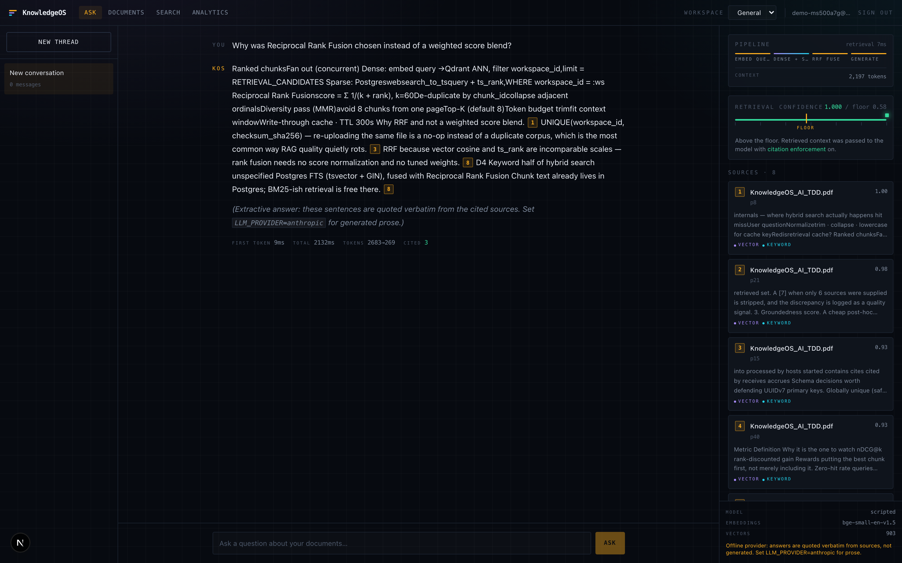
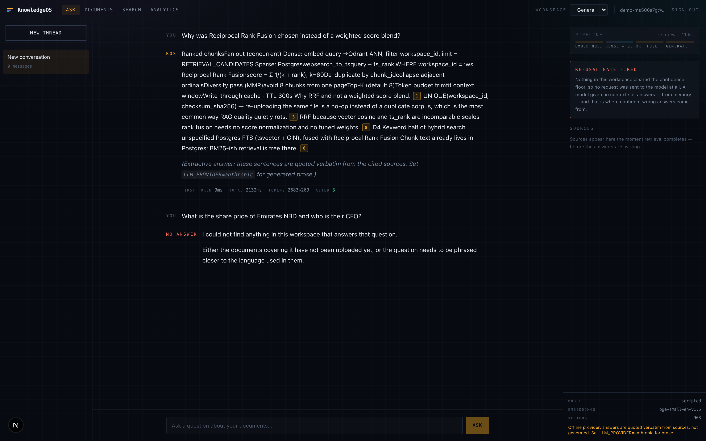
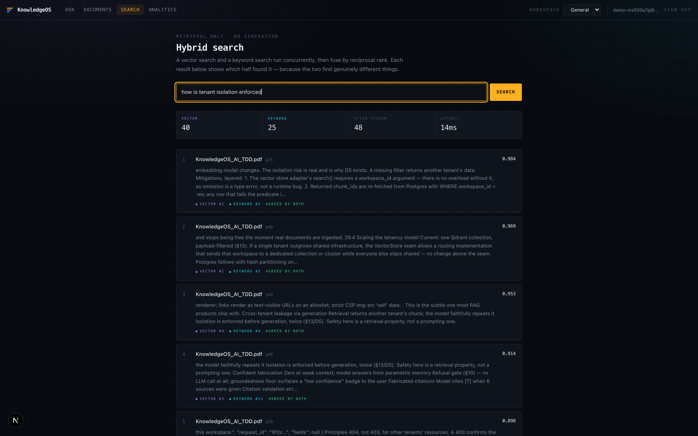
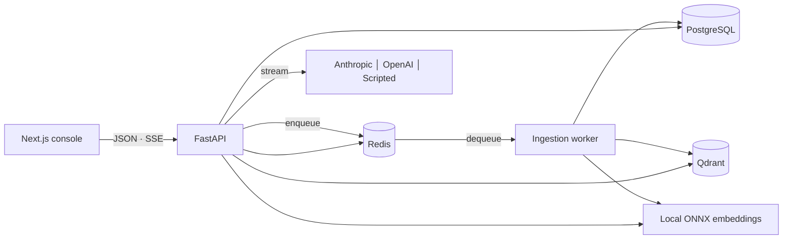
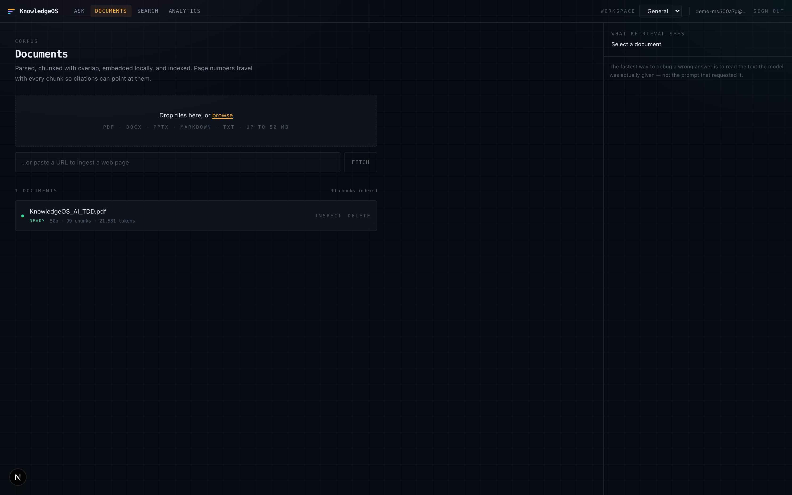
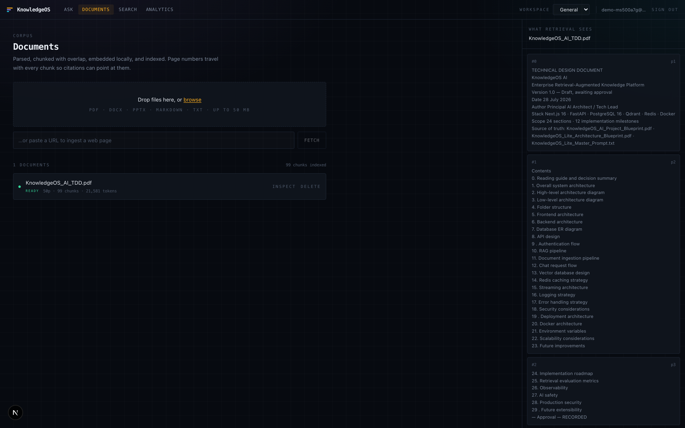
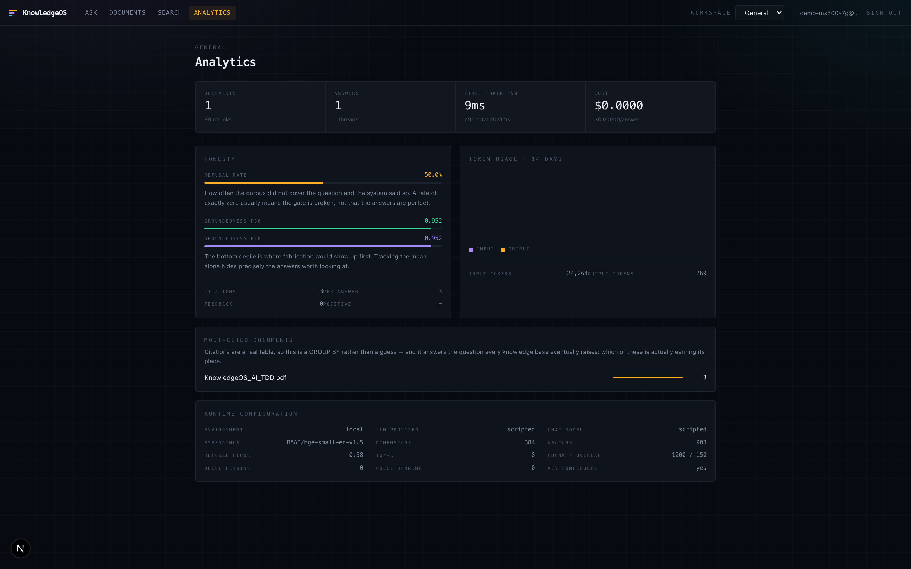

<div align="center">

# KnowledgeOS AI

**An enterprise retrieval-augmented knowledge platform that tells you when it doesn't know.**

Answers drawn only from your own documents · every claim cited back to its page ·
a measured confidence threshold below which the system refuses instead of inventing.

`Next.js 16` · `FastAPI` · `PostgreSQL 16` · `Qdrant` · `Redis` · `Docker`

</div>

---

<div align="center">
  
</div>

---

## What makes this different from a chatbot with a vector database

Most RAG demos answer every question. This one is built around the cases where it
*shouldn't*.

**1. It refuses.** When retrieval finds nothing above a measured cosine threshold,
the system answers "not in this workspace" **without calling the model at all**.
That matters because a model handed zero context still answers — fluently, from
parametric memory, with no signal to the user that it is guessing. It is the
single largest source of confident fabrication in RAG systems, and no amount of
prompting reliably prevents it. Not making the call does.

<div align="center">
  
</div>

**2. The decision is visible.** The *Grounding Meter* plots the retrieval score
against the refusal floor on a calibrated scale. You watch the needle land above
or below the line. The threshold is not a vibe — it was chosen by measurement:

| | top cosine similarity |
|---|---|
| on-topic questions | 0.63 – 0.76 |
| off-corpus questions | 0.49 – 0.52 |
| **floor** | **0.58** — in the gap, with margin both ways |

**3. Citations are verified, not trusted.** The model is asked to emit `[n]`
markers; the backend validates every one against the sources actually supplied and
strips any that don't resolve. A `[7]` when six sources were given is worse than no
citation — it manufactures the appearance of grounding. The stripped-marker rate is
tracked as a quality signal.

**4. Both retrievers are shown.** Dense (vector) and sparse (keyword) run
concurrently and fuse by reciprocal rank. Each result shows which half found it and
at what rank, because "why did this chunk win?" is the first question when an answer
is wrong.

<div align="center">
  
</div>

---

## Run it

Requires Docker. One command from a clean clone:

```bash
make up      # builds, migrates, starts everything
make seed    # creates a demo account and ingests a real document
```

| | |
|---|---|
| Console | http://localhost:3000 |
| API docs | http://localhost:8000/docs |
| Readiness | http://localhost:8000/readyz |

`make seed` prints working credentials and three questions to try — one grounded,
one that fires the refusal gate.

> **No API key needed to try it.** Embeddings run locally on CPU, and
> `LLM_PROVIDER=scripted` ships a deterministic offline provider that quotes
> sources verbatim. Ingestion, hybrid search, citations, analytics and the refusal
> gate are all fully functional with no credential. Set `LLM_PROVIDER=anthropic`
> (or `openai`) and add a key for generated prose — that one variable is the whole
> change.

---

## Architecture



The **write path** is asynchronous — upload returns `202`, a worker parses, chunks,
embeds and indexes, and the document moves `PENDING → PROCESSING → READY`. The
**read path** is synchronous and streamed, and never blocks on ingestion.

Full design document: **[`docs/TDD.md`](docs/TDD.md)** — 29 sections covering
architecture, ER model, API design, auth flow, RAG pipeline, vector store design,
caching, streaming, logging, error handling, security, deployment, scalability,
retrieval-evaluation metrics, observability, AI safety, production security and
extensibility. A rendered PDF is at
[`docs/KnowledgeOS_AI_TDD.pdf`](docs/KnowledgeOS_AI_TDD.pdf).

### Decisions worth defending

| Decision | Why |
|---|---|
| **Local ONNX embeddings**, not a vendor API | Anthropic ships no embeddings API, so a deployment holding only that credential *cannot embed at all*. Local inference costs nothing per token, adds no second vendor, and no document text leaves the deployment — for an enterprise knowledge platform that's a selling point. It also means the whole retrieval half is buildable and testable with no credential. |
| **Reciprocal Rank Fusion**, not a weighted score blend | Cosine sits on `[-1,1]`; Postgres `ts_rank` is unbounded and corpus-dependent. Blending needs per-corpus normalisation that drifts as documents are added. RRF uses rank *position* only — scale-free, no tuning, and it degrades gracefully when one retriever returns nothing. |
| **Postgres full-text**, not Elasticsearch | Chunk text already lives in Postgres; a generated `tsvector` with a GIN index is free there. One less service to run and reconcile. |
| **Tenant isolation enforced twice** | SQL predicate *and* Qdrant payload filter, with post-fetch re-verification. A vector store returning another tenant's chunk is a breach no prompt can undo. The vector store's `search()` *requires* `workspace_id`, so omitting it is a type error. |
| **Worker-based ingestion** over a reliable queue | A 200-page PDF is minutes of parse + embed. In-request it occupies a web worker, dies on client disconnect, and cannot retry. `BRPOPLPUSH` + a reaper means a crashed worker loses no work. |
| **SSE, not WebSockets** | Traffic is server→client only. SSE passes every proxy, reconnects natively, and carries no connection state, so any replica can serve the next request. |
| **404, not 403, across tenants** | A 403 confirms the resource exists. |

---

## The rest of the interface

<table>
<tr>
<td width="50%"><br><em>Ingestion states are shown honestly rather than hidden behind a spinner.</em></td>
<td width="50%"><br><em>The chunk inspector: the fastest way to debug a wrong answer is to read what the model was actually given.</em></td>
</tr>
<tr>
<td colspan="2"><br><em>Cost, latency and honesty metrics. Refusal rate and bottom-decile groundedness are tracked because a mean hides exactly the answers worth looking at.</em></td>
</tr>
</table>

---

## Engineering

```
backend/app/
├── api/        HTTP boundary — routers, dependencies, DTO mapping
├── services/   domain logic — MUST NOT import FastAPI
├── providers/  vendor adapters behind Protocols
├── db/         models, session, migrations
└── schemas/    Pydantic DTOs — the API contract
```

Dependencies point one way. Services take a `Session` and plain objects, never a
`Request`, which is what makes them unit-testable without an ASGI client and
reusable by the worker — which has no HTTP context at all.

**Extension points.** `LLMProvider`, `EmbeddingProvider`, `VectorStore`,
`StorageBackend` and `DocumentParser` are Python `Protocol`s. Adding OCR for scanned
PDFs is one new module, one registry line and one golden-file test; the pipeline,
services, API and frontend are untouched. `Reranker` and `Chunker` seams are defined
and unimplemented, so cross-encoder reranking can be added without a redesign.

**Quality gate** — everything below must pass:

```bash
make check     # ruff + mypy + tests
```

| | |
|---|---|
| `ruff` | clean, warnings-as-errors, exemptions justified individually |
| `mypy` | clean across 73 source files |
| `pytest` | 58 tests against **real** Postgres, Redis and Qdrant |

The suite runs against real infrastructure rather than mocks, because mocking the
database means never exercising the generated `tsvector`, the cascade rules or the
unique constraints — precisely the things most likely to be wrong. Only the LLM is
substituted, by the `ScriptedProvider` that ships in the application itself.

The isolation tests are the most important ones: a second tenant querying the
first's workspace, documents, chunks and analytics must get `404` every time.

---

## Security

| Surface | Control |
|---|---|
| Passwords | Argon2id, memory-hard, ~100 ms tuned |
| Sessions | 30-min access JWT with a verified `typ` claim + rotating refresh token in an httpOnly cookie; replaying a spent token revokes the whole family |
| Storage | Only the SHA-256 of a refresh token is stored |
| Enumeration | Unknown email and wrong password are indistinguishable in status, body and timing |
| **SSRF** | Scheme allowlist, resolve-then-vet DNS, connect to the pinned IP with `Host` preserved (defeats rebinding), every redirect re-validated, size and content-type caps |
| Uploads | Magic-byte sniffing — a `.pdf` that is really a zip is rejected; size enforced *while streaming* |
| **Prompt injection** | Retrieved text is delimited and escaped; the system prompt states source content is data, never instruction; no tool calling in the answer path |
| **Exfiltration** | Remote images blocked in both the renderer and CSP — `` is a real channel |
| Headers | CSP, `nosniff`, `DENY` framing, no referrer, Permissions-Policy, HSTS in production |
| Containers | Non-root uid 10001, multi-stage builds, `tini` as PID 1, ports bound to loopback |

---

## Status and honesty

- **Works today, with no API key**: ingestion, chunking, embeddings, hybrid search,
  citations, refusal gate, analytics, streaming, the full auth and isolation model.
- **Needs a key**: generated prose. Until then `LLM_PROVIDER=scripted` returns an
  *extractive* answer — sentences quoted verbatim from the cited sources — and the
  interface labels it as such. Presenting extraction as generation would be a lie
  to whoever is reading the demo.
- **Not implemented**: OCR for scanned PDFs (they fail loudly with a clear reason
  rather than ingesting as empty), cross-encoder reranking, SSO, S3 storage backend.
  Each has a defined seam; see [`docs/TDD.md`](docs/TDD.md) §29.
- **Evaluation harness** (§25) is specified in full and not yet built. It is the
  highest-value next addition, and it is deliberately not claimed as done.

---

## Licence

MIT — see [LICENSE](LICENSE).
