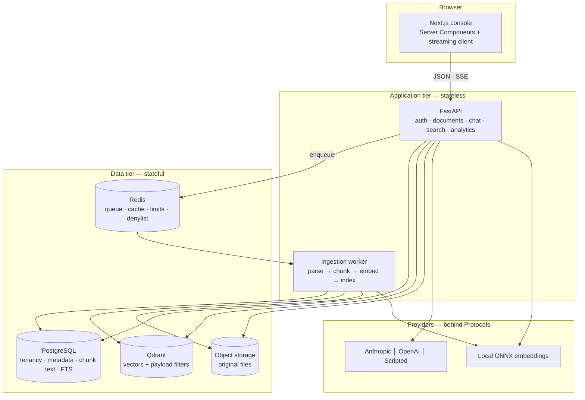
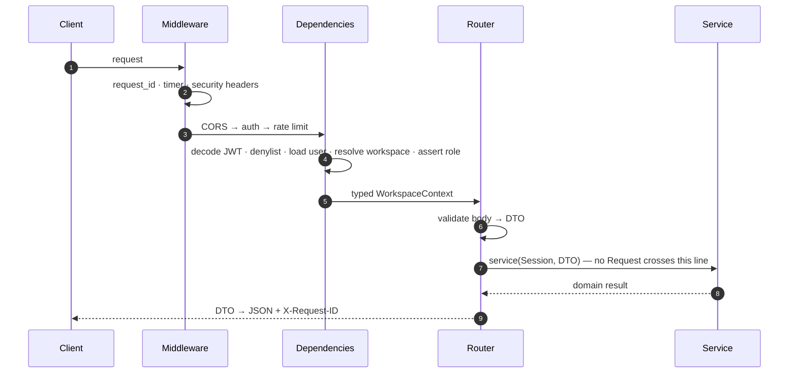
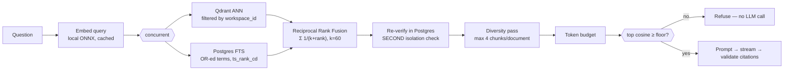

# Architecture

A short orientation. The full contract — 29 sections, ER model, sequence diagrams,
security analysis, roadmap — is in [`TDD.md`](TDD.md). This file is what you read
first.

---

## The shape of it



**Two paths, deliberately different.**

The **write path** is asynchronous and eventually consistent. Upload returns `202`
with a `PENDING` document; a worker picks it up and it becomes `READY`. A 200-page
PDF is minutes of parsing and embedding — doing that in the request would occupy a
web worker, die on client disconnect, and be unable to retry.

The **read path** is synchronous and streamed, and never blocks on ingestion.

---

## Layering

```
api/         FastAPI routers, dependencies, DTO mapping   knows HTTP
services/    business rules, orchestration, pipelines     knows the domain
repositories SQLAlchemy queries, vector access            knows persistence
providers/   Postgres · Qdrant · Redis · LLM · ONNX       knows vendors
```

Dependencies point one way. **A service that imports `fastapi` is a defect** — that
single rule is what makes the layering real rather than decorative. Services take a
`Session` and plain objects, never a `Request`, which is why they are unit-testable
without an ASGI client and reusable by the worker, which has no HTTP context at all.

### Where the important logic lives

| Concern | File |
|---|---|
| Refusal gate | `services/chat_service.py` |
| Rank fusion, diversity | `services/fusion.py` |
| Hybrid retrieval, double isolation check | `services/retrieval_service.py` |
| Citation validation | `services/citation_service.py` |
| Prompt assembly, injection containment | `services/prompt_builder.py` |
| Chunking | `services/chunking.py` |
| Refresh rotation, reuse detection | `services/token_service.py` |
| Tenant resolution | `api/deps.py` — `WorkspaceContext` |

---

## Request lifecycle



---

## Retrieval



Two things in that diagram are the difference between this and a tutorial:

- **The second isolation check.** Qdrant is already filtered by `workspace_id`;
  every returned chunk id is *re-fetched from Postgres with the same predicate*.
  A vector store that returns another tenant's chunk is a breach that no prompt
  can undo, so the boundary is enforced twice.
- **The gate compares raw cosine, not the fused score.** RRF measures rank
  agreement, not relevance — see [`DECISIONS.md`](DECISIONS.md) ADR-002 for why
  gating on the fused score silently never fires.

---

## Data model

Fourteen tables. The ones that carry a decision:

- **`chunks.workspace_id` is denormalised** from `documents`. Retrieval filters by
  workspace on the hot path, and requiring a join to establish tenancy makes it
  easy to forget. Denormalising the *security predicate* makes it hard to omit.
- **`chunks.content_tsv` is `GENERATED ALWAYS`** with a GIN index, so the search
  vector cannot drift from the text — it is not independently writable.
- **`UNIQUE(workspace_id, checksum_sha256)`** on documents. Re-uploading a file is a
  no-op rather than a duplicated corpus, which is the commonest way retrieval
  quality quietly rots.
- **`citations` is a real table**, not JSON on the message, so "which documents does
  this team actually rely on" is a `GROUP BY`.
- **UUIDv7 primary keys** — globally unique but *time-ordered*, so inserts land at
  the right edge of the B-tree instead of scattering like v4 and destroying index
  locality.
- **`usage_events` is append-only** and covers embeddings as well as chat, which is
  what makes reported cost reconcile rather than counting only the visible half.

Full ER diagram: [`TDD.md`](TDD.md) §7.

---

## Consistency between the two stores

**Postgres is the source of truth; Qdrant is a derived index.**

- Ingestion writes Qdrant **before** marking a document `READY`, so a `READY`
  document is always searchable.
- Deletion runs the other way — Qdrant tombstone **first**, then the SQL cascade —
  so a deleted document is never retrievable, not even mid-delete.
- Disaster recovery is therefore "restore Postgres, re-index". That is only possible
  because chunk *text* is stored in Postgres rather than only vectorized, which is
  also what makes an embedding-model migration possible at all (§29.3).

---

## Streaming

SSE, not WebSockets: the traffic is server→client only, SSE passes every proxy,
reconnects natively, and carries no connection state, so any replica can serve the
next request.

```
event: meta        {message_id, sources[], relevance, floor, provider}
event: token       {delta}
event: citations   {validated[], stripped[], groundedness}
event: usage       {input_tokens, output_tokens, ttft_ms, latency_ms}
event: done        {finish_reason}
: heartbeat                                    ← every 15s
```

**Sources are sent before the first token**, so the user sees what the answer will
be based on while it is being written. Citations and usage arrive as *typed frames*
rather than being parsed out of prose — parsing markers from a partial token stream
breaks the first time a model emits `[` at a chunk boundary.

Buffering is disabled end to end (`X-Accel-Buffering: no`, `no-transform`). A
compressing proxy will otherwise hold the entire "stream" and deliver it at once,
which looks exactly like a slow backend and is the classic SSE deployment bug.

---

## Extension points

Every vendor sits behind a `Protocol`:

| Seam | Adding an implementation costs |
|---|---|
| `DocumentParser` | 1 module + 1 registry line + 1 golden-file test |
| `EmbeddingProvider` | 1 module + config (+ a re-embed, see §29.3) |
| `LLMProvider` | 1 module + registry — proven three times |
| `VectorStore` | 1 module (pgvector is the obvious second) |
| `StorageBackend` | 1 module |
| `Reranker`, `Chunker` | seams defined, unimplemented |

Adding OCR for scanned PDFs touches three files. The pipeline, services, API and
frontend are untouched — which is the test of whether the seams are real.
